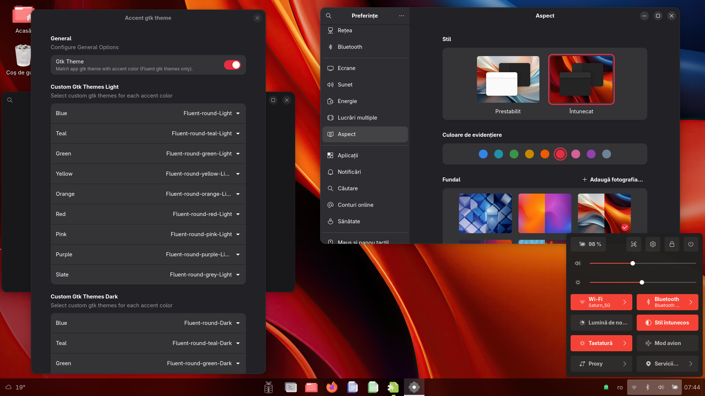

# Accent Gtk Theme
It is a Gnome extension that changes the gtk app theme, based on the accent color chosen by the user in Gnome Settings, Appearance screen and by preferred color schema Light or Dark.   
The extension is a modification of the [Accent Color Icon Theme Changer For GNOME](https://github.com/taiwbi/gnome-accent-directories) extension, thank you `Mohammad Mahdi Tayebi` for your work.  
This extension is included in **BRGV-OS** Linux distribution.  

  
  
## What is necessary ...
BRGV-OS have all [Fluent themes](https://github.com/vinceliuice/Fluent-gtk-theme) installed in `/usr/share/themes`, thank you `Vince` for your work:
```txt
Fluent-round
Fluent-round-Dark
Fluent-round-Dark-compact
Fluent-round-Light
Fluent-round-Light-compact
Fluent-round-compact
Fluent-round-green
Fluent-round-green-Dark
Fluent-round-green-Dark-compact
Fluent-round-green-Light
Fluent-round-green-Light-compact
Fluent-round-green-compact
Fluent-round-grey
Fluent-round-grey-Dark
Fluent-round-grey-Dark-compact
Fluent-round-grey-Light
Fluent-round-grey-Light-compact
Fluent-round-grey-compact
Fluent-round-orange
Fluent-round-orange-Dark
Fluent-round-orange-Dark-compact
Fluent-round-orange-Light
Fluent-round-orange-Light-compact
Fluent-round-orange-compact
Fluent-round-pink
Fluent-round-pink-Dark
Fluent-round-pink-Dark-compact
Fluent-round-pink-Light
Fluent-round-pink-Light-compact
Fluent-round-pink-compact
Fluent-round-purple
Fluent-round-purple-Dark
Fluent-round-purple-Dark-compact
Fluent-round-purple-Light
Fluent-round-purple-Light-compact
Fluent-round-purple-compact
Fluent-round-red
Fluent-round-red-Dark
Fluent-round-red-Dark-compact
Fluent-round-red-Light
Fluent-round-red-Light-compact
Fluent-round-red-compact
Fluent-round-teal
Fluent-round-teal-Dark
Fluent-round-teal-Dark-compact
Fluent-round-teal-Light
Fluent-round-teal-Light-compact
Fluent-round-teal-compact
Fluent-round-yellow
Fluent-round-yellow-Dark
Fluent-round-yellow-Dark-compact
Fluent-round-yellow-Light
Fluent-round-yellow-Light-compact
Fluent-round-yellow-compact
```
Also is nice to have installed [Accent Icons](https://extensions.gnome.org/extension/7535/accent-directories/) and [Accent user theme](https://github.com/florintanasa/brgvos-void/tree/main/accent-user-theme%40brgvos), BRGV-OS have by defaults this.
  
In **BRGV-OS** also is instalated [Fluent icon theme](https://github.com/vinceliuice/Fluent-icon-theme):  
  
```txt
Fluent
Fluent-dark
Fluent-green
Fluent-green-dark
Fluent-green-light
Fluent-grey
Fluent-grey-dark
Fluent-grey-light
Fluent-light
Fluent-orange
Fluent-orange-dark
Fluent-orange-light
Fluent-pink
Fluent-pink-dark
Fluent-pink-light
Fluent-purple
Fluent-purple-dark
Fluent-purple-light
Fluent-red
Fluent-red-dark
Fluent-red-light
Fluent-yellow
Fluent-yellow-dark
Fluent-yellow-light
```  

## Warning 

The open-source software included in **BRGV-OS** is distributed in the hope that it will be useful, but **WITHOUT ANY WARRANTY**.

The work is in progress..

