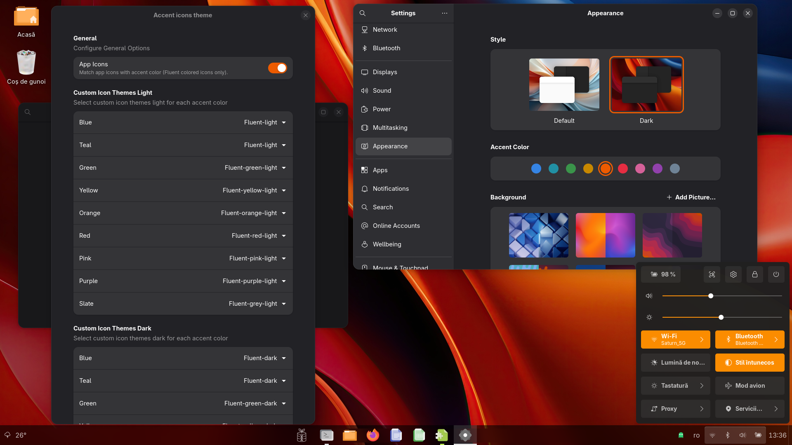

# Accent Icons Theme
It is a Gnome extension that changes the icons themes, based on the accent color chosen by the user in Gnome Settings (gnome-control-center), Appearance screen and by preferred color schema Light or Dark.  
The extension is a modification of the [Accent Color Icon Theme Changer For GNOME](https://github.com/taiwbi/gnome-accent-directories) extension, thank you `Mohammad Mahdi Tayebi` for your work.  
This extension is included in **BRGV-OS** Linux distribution.  

  
  
## What is necessary ...
BRGV-OS have all [Fluent icon theme](https://github.com/vinceliuice/Fluent-icon-theme) installed in `/usr/share/icons`, thank you `Vince` for your work.  
In **BRGV-OS** is allready installed [Fluent icon theme](https://github.com/vinceliuice/Fluent-icon-theme):  
  
```txt
Fluent
Fluent-dark
Fluent-green
Fluent-green-dark
Fluent-green-light
Fluent-grey
Fluent-grey-dark
Fluent-grey-light
Fluent-light
Fluent-orange
Fluent-orange-dark
Fluent-orange-light
Fluent-pink
Fluent-pink-dark
Fluent-pink-light
Fluent-purple
Fluent-purple-dark
Fluent-purple-light
Fluent-red
Fluent-red-dark
Fluent-red-light
Fluent-yellow
Fluent-yellow-dark
Fluent-yellow-light
```  
  
Also is nice to have installed [Accent gtk theme](https://github.com/florintanasa/brgvos-void/tree/main/accent-gtk-theme%40brgvos) and [Accent user theme](https://github.com/florintanasa/brgvos-void/tree/main/accent-user-theme%40brgvos), BRGV-OS have by defaults this.
  
> [!IMPORTANT]  
> In this moment Fluent icons not have for teal color a theme, I used blue icon theme for this accent color...

## Warning 

The open-source software included in **BRGV-OS** is distributed in the hope that it will be useful, but **WITHOUT ANY WARRANTY**.

The work is in progress...
