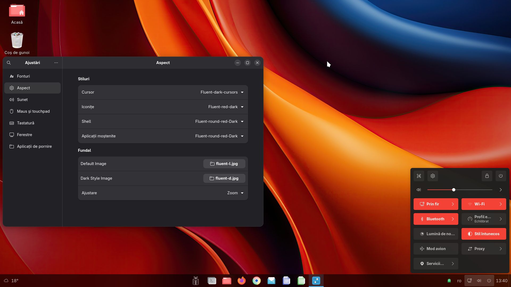
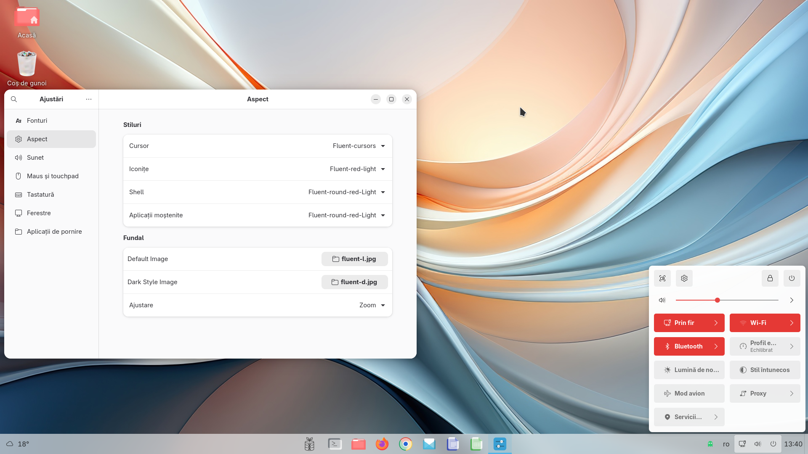

# Light/Dark Cursor Theme
It is a Gnome extension that changes the cursor themes, based on the preferred color schema Light or Dark.  
The extension is a modification of the [Accent Color Icon Theme Changer For GNOME](https://github.com/taiwbi/gnome-accent-directories) extension, thank you `Mohammad Mahdi Tayebi` for your work.  
This extension is included in **BRGV-OS** Linux distribution.  
| Dark Cursor Theme | Light Cursor Theme |
|:-----------------:|:------------------:|
|||  
    
## What is necessary ...  
BRGV-OS have all [Fluent icon theme](https://github.com/vinceliuice/Fluent-icon-theme) installed in `/usr/share/icons`, thank you `Vince` for your work.  
In **BRGV-OS** is allready installed [Fluent icon theme](https://github.com/vinceliuice/Fluent-icon-theme), with next theme cursors:  
  
```txt
Fluent-cursors
Fluent-dark-cursors 
```  
  
Also is nice to have installed [Accent gtk theme](https://github.com/florintanasa/brgvos-void/tree/main/accent-gtk-theme%40brgvos), [Accent user theme](https://github.com/florintanasa/brgvos-void/tree/main/accent-user-theme%40brgvos), and [Accent icons theme](https://github.com/florintanasa/brgvos-void/tree/main/accent-icons-theme%40brgvos), BRGV-OS have by defaults this. 
  

## Warning 

The open-source software included in **BRGV-OS** is distributed in the hope that it will be useful, but **WITHOUT ANY WARRANTY**.

The work is in progress...
